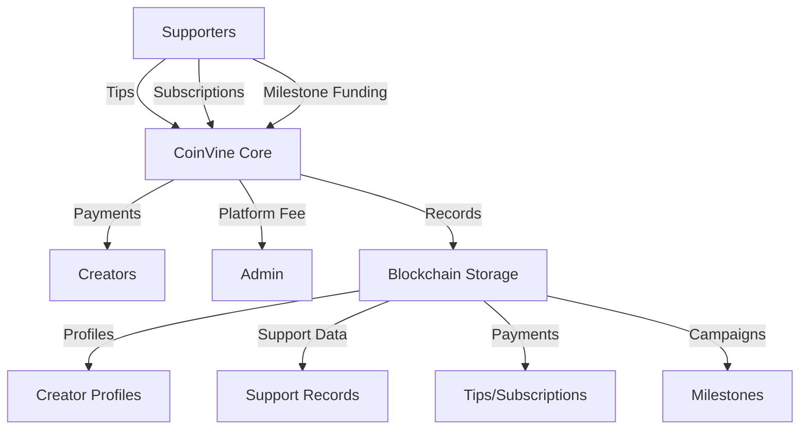

# CoinVine: Content Creator Reward Platform

A blockchain-based platform connecting content creators with their supporters through direct token payments, subscriptions, and milestone-based funding.

## Overview

CoinVine enables content creators to monetize their work directly through their community, eliminating intermediaries while maintaining full transparency. The platform supports:

- One-time tips with optional messages
- Recurring subscription payments
- Milestone-based funding campaigns
- Transparent on-chain tracking of all supporter relationships
- Verifiable creator growth metrics

## Architecture

The platform is built around a core smart contract that manages creator profiles, supporter relationships, and various payment mechanisms.



## Contract Documentation

### coinvine-core.clar

The main contract handling all platform functionality.

#### Key Features:
- Creator profile management
- Support record tracking
- Payment processing with platform fees
- Subscription management
- Milestone-based funding campaigns

#### Access Control:
- Administrative functions restricted to contract admin
- Creator functions verified by principal
- Supporter functions open to all users with sufficient funds

## Getting Started

### Prerequisites
- Clarinet
- STX wallet with sufficient balance for transactions

### Basic Usage

1. Register as a creator:
```clarity
(contract-call? .coinvine-core register-creator "Creator Name" "Description" "Category")
```

2. Send a tip to a creator:
```clarity
(contract-call? .coinvine-core send-tip creator-address u1000 none true)
```

3. Subscribe to a creator:
```clarity
(contract-call? .coinvine-core subscribe-to-creator creator-address u100 u30)
```

## Function Reference

### Creator Functions

```clarity
(register-creator (name (string-ascii 64)) (description (string-utf8 500)) (category (string-ascii 64)))
(update-creator-profile (name (string-ascii 64)) (description (string-utf8 500)) (category (string-ascii 64)))
(create-milestone (title (string-ascii 64)) (description (string-utf8 500)) (target-amount uint) (deadline-blocks uint))
(claim-milestone-funds (milestone-id uint))
```

### Supporter Functions

```clarity
(send-tip (creator principal) (amount uint) (message (optional (string-utf8 280))) (public-recognition bool))
(subscribe-to-creator (creator principal) (amount uint) (frequency-days uint))
(cancel-subscription (subscription-id uint))
(contribute-to-milestone (milestone-id uint) (amount uint))
```

### Administrative Functions

```clarity
(set-contract-admin (new-admin principal))
(set-platform-fee (new-fee-bps uint))
```

## Development

### Testing
1. Clone the repository
2. Install Clarinet
3. Run tests:
```bash
clarinet test
```

### Local Development
1. Start Clarinet console:
```bash
clarinet console
```
2. Deploy contracts:
```clarity
(contract-call? .coinvine-core ...)
```

## Security Considerations

### Platform Fees
- Platform fees are capped at 10%
- Fee transfers are handled separately from creator payments
- Failed fee transfers don't block creator payments

### Payment Processing
- All payments are atomic operations
- Support records are updated only after successful transfers
- Subscription cancellations preserve historical data

### Milestones
- Funds are released only after reaching target amount
- Deadline enforcement prevents indefinite fundraising
- Contribution tracking per supporter
- Creator claiming requires verification checks

### Known Limitations
- Subscription payments require manual triggering
- No partial refunds for incomplete milestones
- Fixed payment token (STX only)
- Message size limits in tips